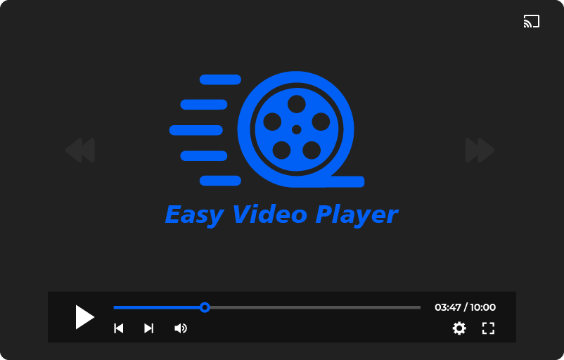
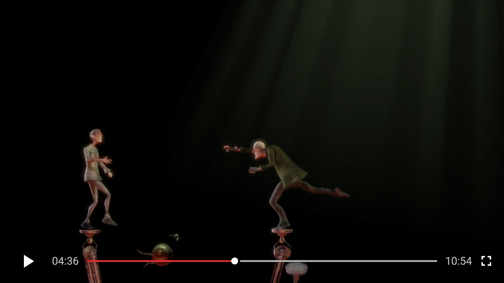
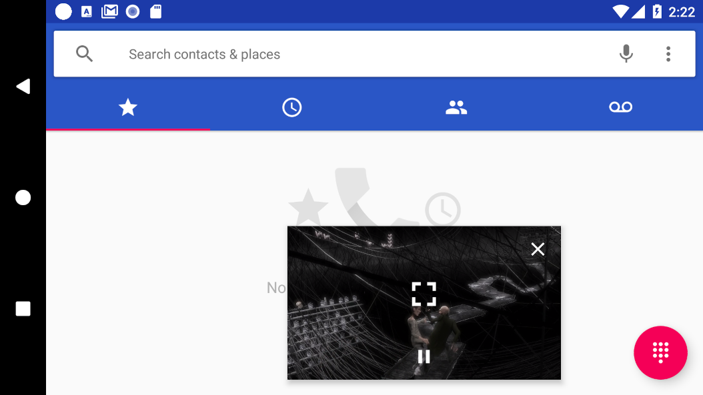

# Easy Video Player




Video player use to play local and network video in android






# Feautres

- play local/network video
- standard playback controller
- pinch to zoom for tall heighted devices (like youtube)
- double tap on left/right for fastforwad (like youtube)
- Pip Support (picture in picture mode)
- Chromecast support
- play encrypted file

Download
--------

Grab via Maven:

```xml

<dependency>
    <groupId>com.dc.videoplayer</groupId>
    <artifactId>videoplayer</artifactId>
    <version>1.0</version>
    <type>pom</type>
</dependency>
```

or Gradle:

```groovy
implementation "com.dc.easyvideoplayer:easyvideoplayer:1.0"
```

# How it works?

```kotlin
  val videoPlayerConfig =
            VideoPlayerConfig
                .Builder()
                .videoPath(path)
                .allowPictureInPicture(true)
                .autoPlay(true)
                .loopVideo(true)
                .orientation(VideoPlayerConfig.ORIENTATION_LANDSCAPE_ONLY)
                .build()
        startActivity(VideoPlayerActivity.createIntent(this, videoPlayerConfig))
```

# License

```
Copyright 2017 DC Infotech

Licensed under the Apache License, Version 2.0 (the "License");
you may not use this file except in compliance with the License.
You may obtain a copy of the License at

   http://www.apache.org/licenses/LICENSE-2.0

Unless required by applicable law or agreed to in writing, software
distributed under the License is distributed on an "AS IS" BASIS,
WITHOUT WARRANTIES OR CONDITIONS OF ANY KIND, either express or implied.
See the License for the specific language governing permissions and
limitations under the License.
